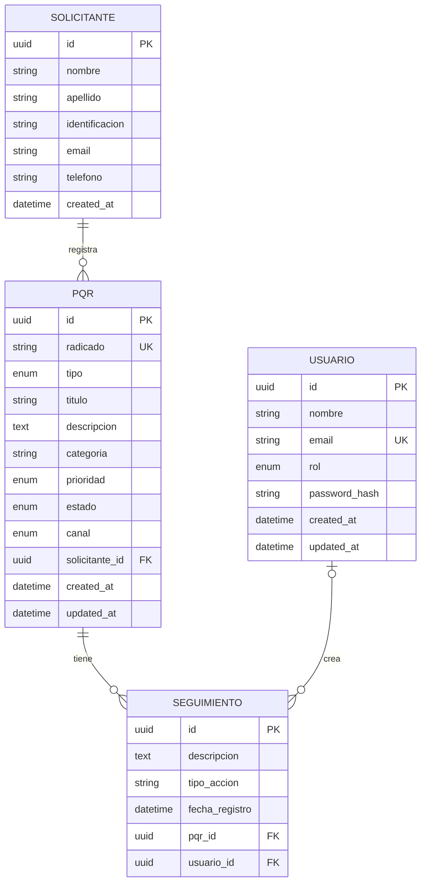
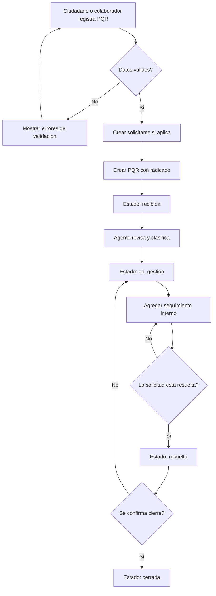

# Analisis inicial del sistema PQR

Fecha: 2026-07-01

## Objetivo

Construir un MVP web para gestionar PQR (Peticiones, Quejas y Reclamos), permitiendo que ciudadanos o colaboradores registren solicitudes y que agentes internos las consulten, gestionen, documenten y cierren.

## Actores

- Ciudadano o colaborador: registra y consulta PQR por radicado.
- Agente interno: revisa, filtra, actualiza estado/prioridad y agrega seguimientos.
- Supervisor: consulta estadisticas basicas y monitorea carga operativa.
- Administrador: gestiona usuarios, roles y permisos cuando se implemente autenticacion.

## Alcance obligatorio del MVP

- Registrar una nueva PQR con tipo, categoria, solicitante, descripcion y prioridad.
- Listar PQR con filtros por tipo, estado, prioridad y categoria.
- Ver el detalle de una PQR con su historial de seguimiento.
- Cambiar estado y prioridad usando el flujo `recibida` -> `en_gestion` -> `resuelta` -> `cerrada`.
- Agregar entradas de seguimiento o comentarios internos.
- Consultar una PQR por numero de radicado.
- Construir frontend con listado, formulario de registro, detalle y estadisticas basicas.

## Alcance bonus

- Autenticacion JWT y roles `agente`, `supervisor` y `admin`.
- Docker Compose para backend, frontend y PostgreSQL.
- Datos seed y pruebas automatizadas.
- Coleccion Postman o Bruno.
- Guia de despliegue documentada.

## Historias de usuario

### HU-01 Registrar PQR

Como ciudadano o colaborador, quiero registrar una PQR con mis datos de contacto, tipo, categoria, prioridad y descripcion, para obtener un radicado y dejar constancia de mi solicitud.

Criterios de aceptacion:

- El sistema valida campos obligatorios.
- El sistema crea un numero de radicado unico.
- La PQR queda en estado `recibida`.

### HU-02 Listar y filtrar PQR

Como agente interno, quiero listar las PQR y filtrarlas por tipo, estado, prioridad y categoria, para priorizar la atencion diaria.

Criterios de aceptacion:

- El listado soporta filtros combinables.
- El listado muestra radicado, titulo, tipo, prioridad, estado y fecha de creacion.
- El listado permite abrir el detalle de una PQR.

### HU-03 Ver detalle e historial

Como agente interno, quiero ver la informacion completa de una PQR y su historial de seguimiento, para entender el contexto antes de actuar.

Criterios de aceptacion:

- El detalle muestra datos del solicitante y de la PQR.
- El historial aparece ordenado por fecha de registro.
- Si no hay seguimiento, se muestra un estado vacio claro.

### HU-04 Cambiar estado y prioridad

Como agente interno, quiero cambiar el estado y la prioridad de una PQR, para reflejar su avance real en el proceso.

Criterios de aceptacion:

- Solo se permiten transiciones validas: `recibida` -> `en_gestion` -> `resuelta` -> `cerrada`.
- Todo cambio relevante queda registrado en el historial.
- La fecha de actualizacion cambia con cada modificacion.

### HU-05 Agregar seguimiento

Como agente interno, quiero agregar comentarios o acciones de seguimiento a una PQR, para documentar la gestion realizada.

Criterios de aceptacion:

- El seguimiento queda asociado a una PQR.
- El seguimiento guarda descripcion, tipo de accion, fecha y usuario si existe autenticacion.
- El historial se actualiza despues de crear la entrada.

### HU-06 Buscar por radicado

Como ciudadano o colaborador, quiero consultar una PQR por numero de radicado, para conocer su estado sin revisar todo el listado.

Criterios de aceptacion:

- La busqueda retorna la PQR exacta si el radicado existe.
- Si no existe, el sistema responde con un mensaje claro.
- La consulta no expone datos sensibles innecesarios.

### HU-07 Ver estadisticas basicas

Como supervisor, quiero ver conteos de PQR por estado y tipo, para identificar carga operativa y tendencias basicas.

Criterios de aceptacion:

- El panel muestra cantidad por estado.
- El panel muestra cantidad por tipo.
- La informacion se actualiza con los datos actuales de la base.

### HU-08 Autenticacion y roles

Como administrador, quiero gestionar acceso por roles de agente, supervisor y admin, para proteger acciones internas del sistema.

Criterios de aceptacion:

- Los usuarios internos inician sesion.
- Las acciones internas requieren autenticacion.
- Las acciones administrativas quedan limitadas al rol correspondiente.

## Modelo de datos

Modelo relacional inicial para PostgreSQL.



Enumeraciones:

- `tipo`: `peticion`, `queja`, `reclamo`.
- `prioridad`: `baja`, `media`, `alta`, `urgente`.
- `estado`: `recibida`, `en_gestion`, `resuelta`, `cerrada`.
- `canal`: `web`, `email`, `presencial`.
- `rol`: `agente`, `supervisor`, `admin`.

## Flujo del proceso



Reglas de transicion:

- `recibida` solo puede pasar a `en_gestion`.
- `en_gestion` puede recibir multiples seguimientos antes de pasar a `resuelta`.
- `resuelta` puede volver a `en_gestion` si requiere ajuste, o pasar a `cerrada`.
- `cerrada` no deberia permitir cambios operativos salvo reapertura autorizada.

## Contrato API inicial

Base path: `/api`

| Metodo | Endpoint | Proposito |
| --- | --- | --- |
| `GET` | `/pqr` | Listar PQR con filtros por tipo, estado, prioridad y categoria. |
| `POST` | `/pqr` | Crear una nueva PQR con solicitante y datos de la solicitud. |
| `GET` | `/pqr/:id` | Obtener detalle completo de una PQR. |
| `PATCH` | `/pqr/:id/estado` | Cambiar estado y/o prioridad. |
| `POST` | `/pqr/:id/seguimiento` | Agregar entrada de seguimiento. |
| `GET` | `/pqr/:id/seguimiento` | Listar historial de seguimiento. |
| `GET` | `/pqr/buscar?radicado=...` | Buscar una PQR por numero de radicado. |

Query params de listado:

- `tipo`: `peticion`, `queja`, `reclamo`.
- `estado`: `recibida`, `en_gestion`, `resuelta`, `cerrada`.
- `prioridad`: `baja`, `media`, `alta`, `urgente`.
- `categoria`: texto libre normalizado.
- `page` y `limit`: paginacion.

Payload inicial para crear PQR:

```json
{
  "tipo": "peticion",
  "titulo": "Solicitud de informacion",
  "descripcion": "Necesito conocer el estado de mi tramite.",
  "categoria": "Atencion al usuario",
  "prioridad": "media",
  "canal": "web",
  "solicitante": {
    "nombre": "Ana",
    "apellido": "Perez",
    "identificacion": "123456789",
    "email": "ana@example.com",
    "telefono": "3001234567"
  }
}
```

## Decisiones de arquitectura

Backend: se usara NestJS porque permite organizar la API por modulos, controladores, servicios y DTOs, manteniendo una separacion clara de responsabilidades. La API se expondra como REST bajo `/api`.

Frontend: se usara Vue.js porque permite construir rapidamente las cuatro pantallas MVP con componentes reutilizables, validacion en cliente y consumo directo de la API.

Persistencia: se propone PostgreSQL como base de datos principal por ser una opcion SQL robusta para relaciones entre solicitantes, PQR, seguimientos y usuarios internos. Prisma queda como ORM propuesto para migraciones reproducibles, tipado y consultas mantenibles desde NestJS.

Capas previstas:

- `controller`: entrada HTTP y respuesta.
- `dto`: validacion de payloads y query params.
- `service`: reglas de negocio y transiciones de estado.
- `repository/orm`: acceso a datos.
- `frontend components/views`: pantallas y componentes Vue.

Seguridad y roles: el MVP puede iniciar sin autenticacion publica para el registro y consulta por radicado. Las acciones internas deben quedar preparadas para autenticacion JWT y roles `agente`, `supervisor` y `admin` como mejora prioritaria.

## Uso de asistencia

Se uso asistencia de IA como apoyo puntual para organizar artefactos iniciales de analisis y documentacion. La validacion, ajustes, implementacion y entrega final quedan bajo responsabilidad del desarrollador.
