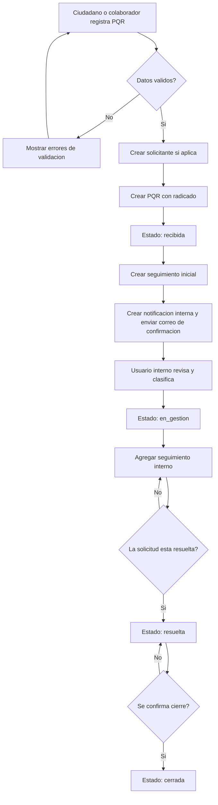

# Flujo del proceso PQR

## Reglas de transicion

- `recibida` solo puede pasar a `en_gestion`.
- `en_gestion` puede recibir multiples seguimientos antes de pasar a `resuelta`.
- `resuelta` solo puede pasar a `cerrada`.
- `cerrada` no permite nuevas transiciones de estado en el flujo base del MVP.
- La prioridad puede actualizarse desde el endpoint de gestion sin cambiar el estado, siempre que exista un cambio real de prioridad.

## Actores por etapa

| Etapa | Actor principal | Resultado |
| --- | --- | --- |
| Registro de PQR | Ciudadano o colaborador | PQR creada con radicado y estado `recibida`. |
| Notificacion | Sistema | Notificacion interna creada y correo de confirmacion enviado al solicitante. |
| Revision inicial | Usuario interno autenticado | PQR clasificada y movida a `en_gestion`. |
| Seguimiento | Usuario interno autenticado | Comentarios o acciones internas agregadas al historial. |
| Resolucion | Usuario interno autenticado | PQR marcada como `resuelta`. |
| Cierre | Usuario interno autenticado | PQR marcada como `cerrada`. |

## Transiciones permitidas

| Estado origen | Estado destino | Actor permitido | Observacion |
| --- | --- | --- | --- |
| `recibida` | `en_gestion` | Usuario interno autenticado | Inicia gestion formal de la solicitud. |
| `en_gestion` | `resuelta` | Usuario interno autenticado | Requiere dejar seguimiento de la accion realizada. |
| `resuelta` | `cerrada` | Usuario interno autenticado | Confirma cierre del caso. |

No se permite cambiar desde `cerrada` en el flujo base del MVP. Los roles `agente`, `supervisor` y `admin` quedan registrados en el usuario autenticado, pero los permisos finos por accion se dejan como evolucion futura.
