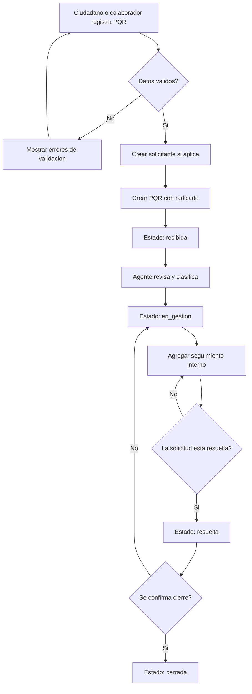

# Flujo del proceso PQR

## Reglas de transicion

- `recibida` solo puede pasar a `en_gestion`.
- `en_gestion` puede recibir multiples seguimientos antes de pasar a `resuelta`.
- `resuelta` puede volver a `en_gestion` si requiere ajuste, o pasar a `cerrada`.
- `cerrada` no deberia permitir cambios operativos salvo reapertura autorizada.

## Actores por etapa

| Etapa | Actor principal | Resultado |
| --- | --- | --- |
| Registro de PQR | Ciudadano o colaborador | PQR creada con radicado y estado `recibida`. |
| Revision inicial | Agente interno | PQR clasificada y movida a `en_gestion`. |
| Seguimiento | Agente interno | Comentarios o acciones internas agregadas al historial. |
| Resolucion | Agente interno o supervisor | PQR marcada como `resuelta`. |
| Cierre | Supervisor o agente autorizado | PQR marcada como `cerrada`. |

## Transiciones permitidas

| Estado origen | Estado destino | Actor permitido | Observacion |
| --- | --- | --- | --- |
| `recibida` | `en_gestion` | Agente interno | Inicia gestion formal de la solicitud. |
| `en_gestion` | `resuelta` | Agente interno | Requiere dejar seguimiento de la accion realizada. |
| `resuelta` | `cerrada` | Supervisor o agente autorizado | Confirma cierre del caso. |
| `resuelta` | `en_gestion` | Supervisor o agente autorizado | Permite devolver la PQR si falta ajuste. |

No se permite cambiar desde `cerrada` en el flujo base del MVP.
