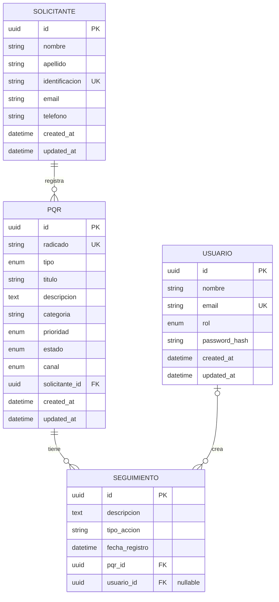

# Modelo de datos

Modelo relacional inicial para PostgreSQL. El diseno prioriza integridad referencial, busqueda por radicado, filtros operativos y trazabilidad del seguimiento.



## Entidades y campos

### `solicitantes`

Representa al ciudadano o colaborador que registra la PQR.

| Campo | Tipo sugerido | Restricciones | Descripcion |
| --- | --- | --- | --- |
| `id` | `uuid` | PK | Identificador interno. |
| `nombre` | `varchar(100)` | not null | Nombre del solicitante. |
| `apellido` | `varchar(100)` | not null | Apellido del solicitante. |
| `identificacion` | `varchar(30)` | unique, not null | Documento o identificacion del solicitante. |
| `email` | `varchar(180)` | not null | Correo de contacto. |
| `telefono` | `varchar(30)` | nullable | Telefono de contacto. |
| `created_at` | `timestamp` | not null | Fecha de creacion. |
| `updated_at` | `timestamp` | not null | Fecha de ultima actualizacion. |

### `pqr`

Representa la solicitud principal y su estado dentro del flujo.

| Campo | Tipo sugerido | Restricciones | Descripcion |
| --- | --- | --- | --- |
| `id` | `uuid` | PK | Identificador interno. |
| `radicado` | `varchar(30)` | unique, not null | Numero publico de consulta. |
| `tipo` | `enum` | not null | Peticion, queja o reclamo. |
| `titulo` | `varchar(180)` | not null | Resumen corto de la solicitud. |
| `descripcion` | `text` | not null | Detalle de la PQR. |
| `categoria` | `varchar(120)` | not null | Categoria operativa. |
| `prioridad` | `enum` | not null | Baja, media, alta o urgente. |
| `estado` | `enum` | not null, default `recibida` | Estado actual del ciclo de vida. |
| `canal` | `enum` | not null, default `web` | Canal de recepcion. |
| `solicitante_id` | `uuid` | FK, not null | Solicitante asociado. |
| `created_at` | `timestamp` | not null | Fecha de creacion. |
| `updated_at` | `timestamp` | not null | Fecha de ultima actualizacion. |

### `seguimientos`

Registra comentarios internos, cambios de estado y acciones realizadas sobre una PQR.

| Campo | Tipo sugerido | Restricciones | Descripcion |
| --- | --- | --- | --- |
| `id` | `uuid` | PK | Identificador interno. |
| `descripcion` | `text` | not null | Descripcion de la accion o comentario. |
| `tipo_accion` | `varchar(80)` | not null | Tipo de seguimiento, por ejemplo comentario, cambio_estado o cambio_prioridad. |
| `fecha_registro` | `timestamp` | not null | Fecha del seguimiento. |
| `pqr_id` | `uuid` | FK, not null | PQR asociada. |
| `usuario_id` | `uuid` | FK, nullable | Usuario interno que registra la accion. |

### `usuarios`

Representa agentes internos. Es deseable para el MVP extendido con autenticacion y roles.

| Campo | Tipo sugerido | Restricciones | Descripcion |
| --- | --- | --- | --- |
| `id` | `uuid` | PK | Identificador interno. |
| `nombre` | `varchar(120)` | not null | Nombre del usuario interno. |
| `email` | `varchar(180)` | unique, not null | Correo para login. |
| `rol` | `enum` | not null | Agente, supervisor o admin. |
| `password_hash` | `varchar(255)` | not null | Hash de la contrasena. |
| `created_at` | `timestamp` | not null | Fecha de creacion. |
| `updated_at` | `timestamp` | not null | Fecha de ultima actualizacion. |

## Enumeraciones

- `tipo`: `peticion`, `queja`, `reclamo`.
- `prioridad`: `baja`, `media`, `alta`, `urgente`.
- `estado`: `recibida`, `en_gestion`, `resuelta`, `cerrada`.
- `canal`: `web`, `email`, `presencial`.
- `rol`: `agente`, `supervisor`, `admin`.

## Llaves, relaciones e indices

- `solicitantes.id` es PK.
- `solicitantes.identificacion` es unico para evitar duplicar solicitantes por documento.
- `pqr.id` es PK.
- `pqr.radicado` es unico y debe indexarse para busqueda rapida por radicado.
- `pqr.solicitante_id` es FK hacia `solicitantes.id`.
- `seguimientos.id` es PK.
- `seguimientos.pqr_id` es FK hacia `pqr.id`.
- `seguimientos.usuario_id` es FK nullable hacia `usuarios.id`, porque el seguimiento puede existir antes de implementar autenticacion.
- `usuarios.id` es PK.
- `usuarios.email` es unico para login.

Indices sugeridos:

- `idx_pqr_estado` sobre `pqr.estado`.
- `idx_pqr_tipo` sobre `pqr.tipo`.
- `idx_pqr_prioridad` sobre `pqr.prioridad`.
- `idx_pqr_categoria` sobre `pqr.categoria`.
- `idx_pqr_created_at` sobre `pqr.created_at`.
- `idx_pqr_filtros` compuesto sobre `pqr.estado`, `pqr.tipo`, `pqr.prioridad`.
- `idx_seguimientos_pqr_fecha` compuesto sobre `seguimientos.pqr_id`, `seguimientos.fecha_registro`.

## Reglas de integridad

- Toda PQR debe pertenecer a un solicitante.
- Una PQR se crea inicialmente en estado `recibida`.
- El radicado debe ser unico y estable durante todo el ciclo de vida.
- Al eliminar una PQR, sus seguimientos deben eliminarse en cascada o bloquearse la eliminacion. Para auditoria se recomienda no eliminar PQR en produccion.
- Al eliminar un usuario, los seguimientos no deben desaparecer; por eso `usuario_id` debe poder quedar en `null` o bloquear la eliminacion del usuario.
- Las transiciones de estado se validan en la capa de servicio, no solo en la base de datos.

## Plan de migracion inicial con Prisma

Cuando se inicialice NestJS y Prisma, la primera migracion debe crear:

1. Enums: `TipoPqr`, `PrioridadPqr`, `EstadoPqr`, `CanalPqr` y `RolUsuario`.
2. Tabla `solicitantes` con indice unico por `identificacion`.
3. Tabla `usuarios` con indice unico por `email`.
4. Tabla `pqr` con FK hacia `solicitantes` e indice unico por `radicado`.
5. Tabla `seguimientos` con FK hacia `pqr` y FK nullable hacia `usuarios`.
6. Indices de consulta para filtros y ordenamiento.

Comando esperado cuando exista el scaffold del backend:

```bash
cd backend
npx prisma migrate dev --name init_pqr_schema
```

La migracion debe quedar versionada dentro de `backend/prisma/migrations/` una vez exista el proyecto NestJS.

## Extensiones futuras: eventos y notificaciones

Estas tablas no hacen parte del alcance obligatorio del MVP. Se dejan documentadas como extension futura o bonus para soportar notificaciones internas en tiempo real y canales externos como email, WhatsApp o SMS.

### Objetivo

- Notificar a agentes, supervisores o administradores cuando una PQR cambie de estado, prioridad o reciba seguimiento.
- Alimentar una campanita de notificaciones en el frontend usando SSE en ambiente local.
- Mantener un diseno extensible para enviar correos en local durante desarrollo y cambiar despues a proveedores externos.
- Permitir agregar otros canales sin cambiar el flujo principal de PQR.

### `eventos_pqr`

Registra eventos de dominio derivados de acciones sobre una PQR. Sirve como historial tecnico para disparar notificaciones sin mezclar esa responsabilidad con la tabla de seguimientos.

| Campo | Tipo sugerido | Restricciones | Descripcion |
| --- | --- | --- | --- |
| `id` | `uuid` | PK | Identificador del evento. |
| `pqr_id` | `uuid` | FK, not null | PQR asociada al evento. |
| `tipo_evento` | `varchar(80)` | not null | Ejemplo: `pqr_creada`, `estado_actualizado`, `prioridad_actualizada`, `seguimiento_creado`. |
| `payload` | `jsonb` | not null | Datos necesarios para procesar el evento. |
| `created_at` | `timestamp` | not null | Fecha de creacion del evento. |

### `notificaciones`

Almacena las notificaciones visibles para usuarios internos. Esta tabla alimenta la campanita y permite marcar notificaciones como leidas.

| Campo | Tipo sugerido | Restricciones | Descripcion |
| --- | --- | --- | --- |
| `id` | `uuid` | PK | Identificador de la notificacion. |
| `evento_id` | `uuid` | FK, nullable | Evento que origino la notificacion. |
| `pqr_id` | `uuid` | FK, not null | PQR relacionada. |
| `usuario_destino_id` | `uuid` | FK, nullable | Usuario especifico que debe recibirla. |
| `rol_destino` | `enum` | nullable | Rol que debe recibirla cuando no se asigna a un usuario especifico. |
| `titulo` | `varchar(180)` | not null | Texto corto para la campanita. |
| `mensaje` | `text` | not null | Descripcion de la notificacion. |
| `leida_at` | `timestamp` | nullable | Fecha en que el usuario la marco como leida. |
| `created_at` | `timestamp` | not null | Fecha de creacion. |

### `entregas_notificacion`

Representa intentos de envio por un canal especifico. Permite manejar email local en desarrollo y otros canales a futuro.

| Campo | Tipo sugerido | Restricciones | Descripcion |
| --- | --- | --- | --- |
| `id` | `uuid` | PK | Identificador del intento de entrega. |
| `notificacion_id` | `uuid` | FK, not null | Notificacion base. |
| `canal` | `enum` | not null | `sse`, `email`, `whatsapp`, `sms`. |
| `destinatario` | `varchar(180)` | nullable | Email, telefono o identificador del receptor. |
| `estado` | `enum` | not null | `pendiente`, `enviada`, `fallida`. |
| `intentos` | `int` | not null, default `0` | Cantidad de intentos realizados. |
| `error` | `text` | nullable | Ultimo error del envio, si aplica. |
| `sent_at` | `timestamp` | nullable | Fecha de envio exitoso. |
| `created_at` | `timestamp` | not null | Fecha de creacion. |
| `updated_at` | `timestamp` | not null | Fecha de ultima actualizacion. |

### Canales previstos

- `sse`: canal local para notificaciones internas en tiempo real hacia la campanita del frontend.
- `email`: canal preparado para servidor SMTP local en desarrollo, por ejemplo MailHog o Mailpit.
- `whatsapp`: canal futuro para proveedor externo.
- `sms`: canal futuro para proveedor externo.

### Reglas de diseno

- La creacion o actualizacion de una PQR genera un `evento_pqr`.
- Un evento puede crear una o varias `notificaciones`, segun el rol o usuario destino.
- La campanita consulta notificaciones pendientes y puede recibir nuevos eventos por SSE.
- El envio externo se maneja mediante `entregas_notificacion` para no acoplar el dominio PQR a un proveedor especifico.
- Si falla un canal externo, la PQR no debe fallar; el error queda registrado en la entrega de notificacion.
- Para el MVP obligatorio, esta extension puede quedar solo documentada y no implementada.
