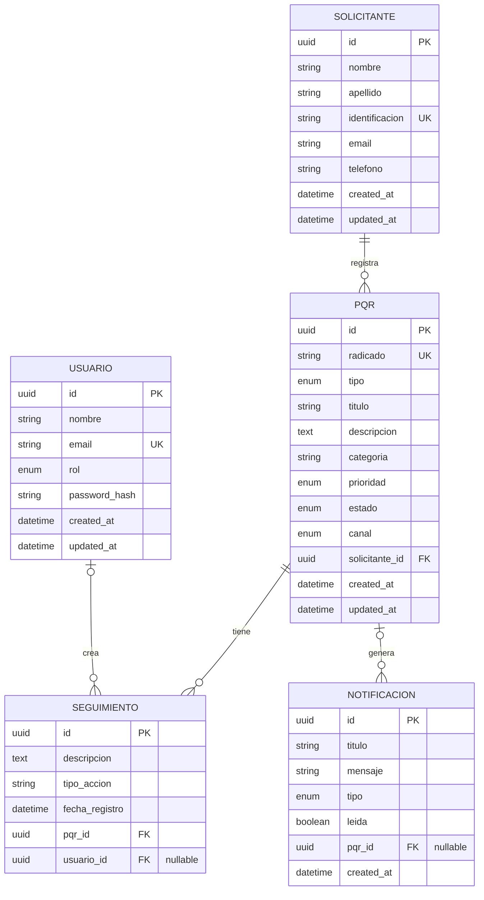

# Modelo de datos

Modelo relacional del MVP PQR. La autenticacion interna se soporta con la tabla `usuarios`; no se requiere una tabla adicional de auth para este alcance.

```mermaid
erDiagram
  SOLICITANTE ||--o{ PQR : registra
  PQR ||--o{ SEGUIMIENTO : tiene
  USUARIO o|--o{ SEGUIMIENTO : crea
  PQR o|--o{ NOTIFICACION : genera

  SOLICITANTE {
    uuid id PK
    string nombre
    string apellido
    string identificacion UK
    string email
    string telefono
    datetime created_at
    datetime updated_at
  }

  USUARIO {
    uuid id PK
    string nombre
    string email UK
    enum rol
    string password_hash
    datetime created_at
    datetime updated_at
  }

  PQR {
    uuid id PK
    string radicado UK
    enum tipo
    string titulo
    text descripcion
    string categoria
    enum prioridad
    enum estado
    enum canal
    uuid solicitante_id FK
    datetime created_at
    datetime updated_at
  }

  SEGUIMIENTO {
    uuid id PK
    text descripcion
    string tipo_accion
    datetime fecha_registro
    uuid pqr_id FK
    uuid usuario_id FK "nullable"
  }

  NOTIFICACION {
    uuid id PK
    string titulo
    string mensaje
    enum tipo
    boolean leida
    uuid pqr_id FK "nullable"
    datetime created_at
  }
```
